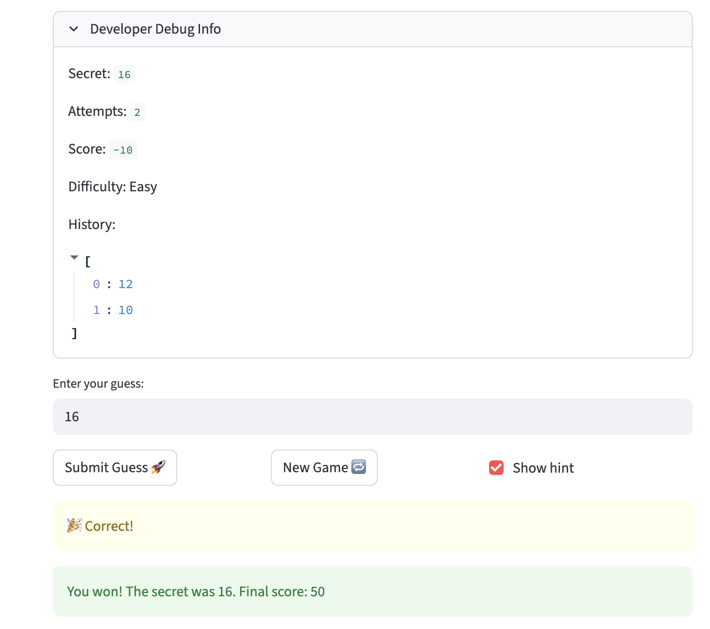
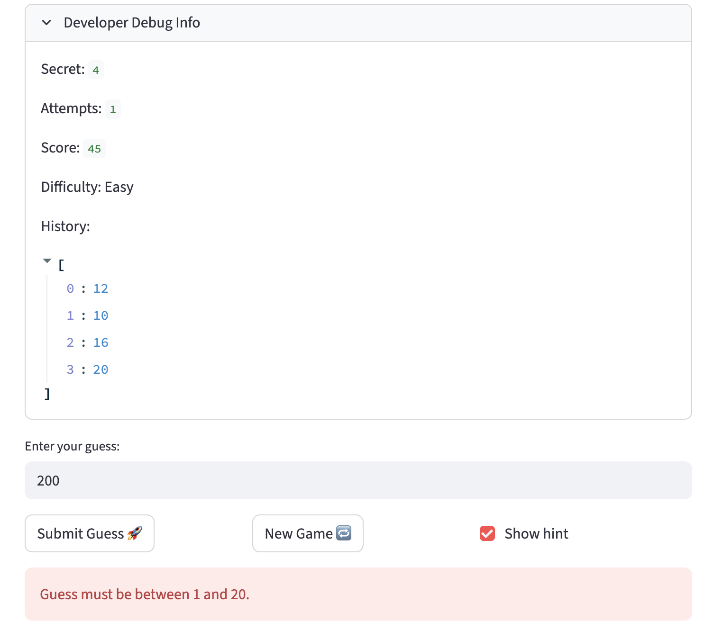

# 🎮 Game Glitch Investigator: The Impossible Guesser

## 🚨 The Situation

You asked an AI to build a simple "Number Guessing Game" using Streamlit.
It wrote the code, ran away, and now the game is unplayable.

## 🛠️ Setup

1. Install dependencies: `pip install -r requirements.txt`
2. Run the broken app: `python -m streamlit run app.py`

## 🕵️‍♂️ Your Mission

1. **Play the game.** Open the "Developer Debug Info" tab in the app to see the secret number. Try to win.
2. **Find the State Bug.** Why does the secret number change every time you click "Submit"? Ask ChatGPT: _"How do I keep a variable from resetting in Streamlit when I click a button?"_
3. **Fix the Logic.** The hints ("Higher/Lower") are wrong. Fix them.
4. **Refactor & Test.** - Move the logic into `logic_utils.py`.
   - Run `pytest` in your terminal.
   - Keep fixing until all tests pass!

## 📝 Document Your Experience

- The game is a simple number guessing game built with Streamlit where the player tries to guess a hidden secret number within a limited number of attempts. The player chooses a difficulty, which sets both the range of possible numbers and how many guesses they get. After each guess, the game gives a hint telling the player whether they should go higher or lower, and it tracks a score based on how efficiently they guess. The purpose of the project is not just to play, but to investigate and fix glitches in an AI‑generated codebase, especially around state and game logic.

- ## Issues Identified

- The **"higher/lower" hints were reversed**. When my guess was too low, the game told me to go lower, and when it was too high, it told me to go higher.

- After clicking **"New Game"** following a win or loss, the app still displayed **"You already won"** or **“Game over”**, and the game did not properly start a new round.

- The **difficulty ranges were inconsistent**. The sidebar showed ranges like **1-20 for Easy**, but the game text and secret number behaved as if the range was **always 1–100**.

- The app allowed users to **enter any integer**, even numbers far outside the supposed bounds, without showing an error.

- There were **state management issues** with the **attempt counter and secret number**, which made the game feel inconsistent and unfair.

- I corrected the hint logic so that a too‑low guess now correctly tells the player to go higher, and a too‑high guess tells them to go lower. I updated the “New Game” behavior to reset the game state (status, attempts, and secret) so that starting a new game really gives a clean slate instead of carrying over “Game over” or “You already won” messages. I made the displayed range and the actual secret number generation respect the selected difficulty, and I added validation so guesses have to fall inside that range. Finally, I relied on Streamlit’s st.session_state so the secret number and attempts stay stable across reruns, and I used small tests (like calling check_guess with known values) to confirm that only the buggy parts changed while the rest of the app kept working as intended.

## 📸 Demo

- **Correct "Go Higher" hint**

  

- **Correct "Go Lower" hint**

  

- **Winning game state**

  

- **Out-of-range / error handling**

  
