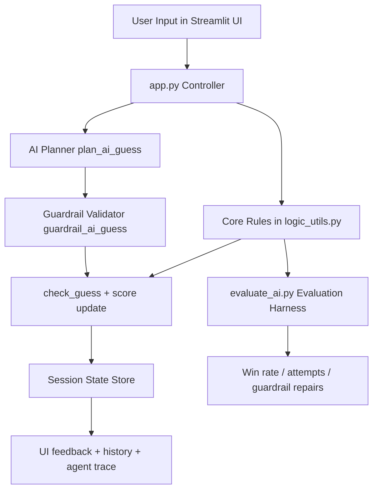

# AI-Powered Game Glitch Investigator

## Base Project and Original Scope

This project extends the original **Streamlit Number Guessing Game** starter.
Originally, the system let a user choose a difficulty, guess a hidden number, receive higher/lower hints, and track score and attempts.
The starter lab goal was to debug broken AI-generated logic and state handling.

## What Was Added (Substantial AI Feature)

The app now includes an integrated **AI Guess Strategist** with a multi-step workflow:

1. **Plan step** (`plan_ai_guess`): infer possible number bounds from prior hints and propose the next guess.
2. **Guardrail step** (`guardrail_ai_guess`): validate plan output and automatically repair invalid guesses.
3. **Execution step**: apply the final guess to the live game and store a trace (plan, guardrail status, confidence, outcome).

This is integrated into the main app via the `AI Suggest Next Guess 🤖` button and affects real gameplay state, score, and outcomes.

## Architecture Diagram



## Reliability / Evaluation / Guardrails

- **Input validation:** empty/non-numeric/out-of-range values are blocked.
- **AI output guardrail:** invalid AI guesses are auto-repaired to a safe bounded midpoint.
- **Evaluation harness:** `evaluate_ai.py` runs deterministic scenarios and reports win rate, attempts, and guardrail interventions.

Example reliability behavior:
- If AI proposes `999` in a `1-100` game with narrowed bounds `51-74`, guardrail repairs to midpoint in-range.

## Setup

1. Create/activate a virtual environment (recommended).
2. Install dependencies:
   - `pip install -r requirements.txt`
3. Run tests:
   - `pytest`

## Run End-to-End System

### Streamlit UI

Run:
- `python -m streamlit run app.py`

In the app:
1. Pick difficulty.
2. Play manually with `Submit Guess 🚀`, or
3. Enable `AI Guess Strategist` and click `AI Suggest Next Guess 🤖`.

### Evaluation Script

Run:
- `python evaluate_ai.py`

This demonstrates full workflow for 3 sample inputs (`secret=7`, `42`, `88`) and prints stable metrics.

## Sample Input/Output

### Sample UI Inputs
- Difficulty: `Normal`
- User guess: `40` -> Hint: `Go HIGHER`
- User guess: `60` -> Hint: `Go LOWER`
- AI step -> planned guess + guardrail status shown in UI

### Sample Evaluation Output

```text
=== AI Strategist Evaluation ===
Scenarios: 3
Wins: 3/3
Average attempts: 5.67
Guardrail repairs: 0
...
```

## Demo Screenshots

- Correct "Go Higher" hint: 
- Correct "Go Lower" hint: 
- Winning game state: 
- Out-of-range error handling: 
